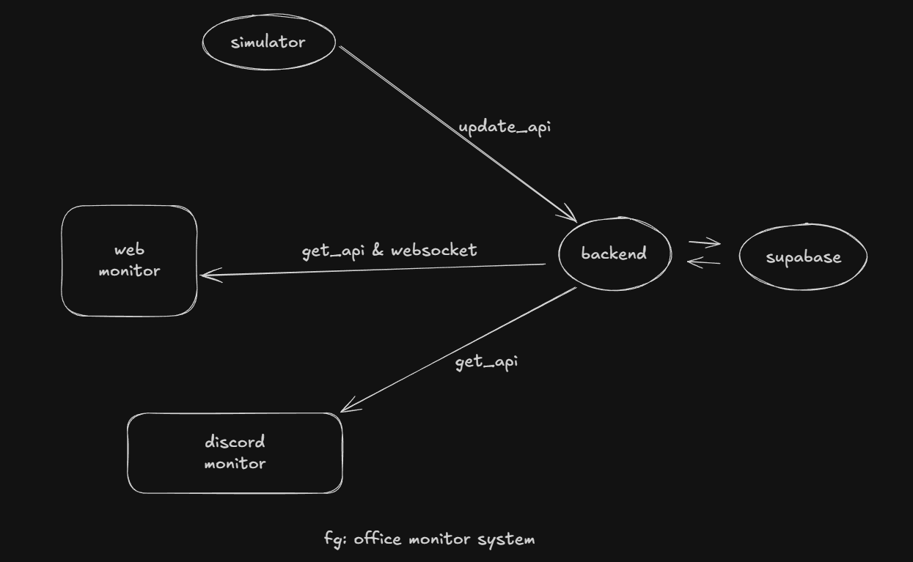
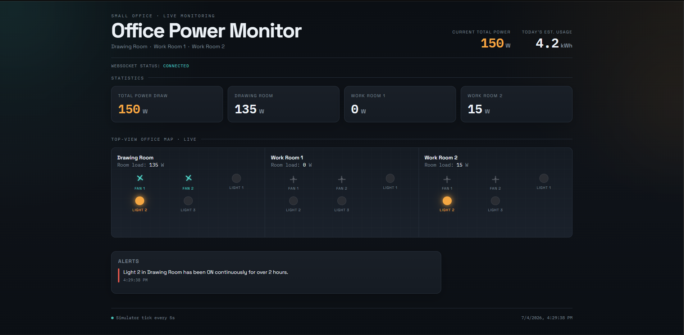
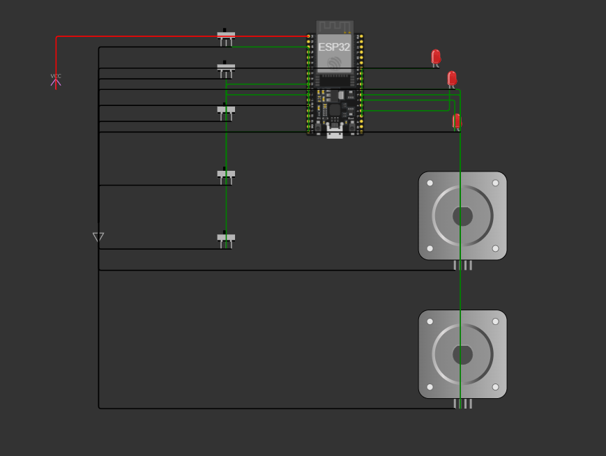

# Techathon2026 - Dinosaur

An office monitoring system with live device updates, a web dashboard, and a Discord bot for checking room status and total power usage.

## Overview

This project monitors office devices in real time. The office has two rooms, and each room contains five devices: three lights and two fans. When any device changes state, the dashboard updates live through WebSocket events, and the Discord bot can report the current office status from the backend.

## System Design

The high-level system design is shown below.



## Web Dashboard

The dashboard presents the live office state, power usage, and alerts in a single view.



## ESP32 Monitoring Circuit

The office devices are monitored through the ESP32 circuit used in the Drawing Room for lights and fans.



## Features

- Live dashboard updates over WebSocket
- Room-by-room device status view
- Current power usage summary
- Discord bot status commands
- Simulator script for pushing device state into the backend

## Project Structure

- `backend/` - Flask API and Socket.IO server
- `frontend/` - Vite + React dashboard UI
- `BOT/` - Discord bot
- `simulator/` - Device state simulator
- `requirements.txt` - Python dependencies for backend, bot, and simulator

## Setup

Install the Python dependencies before running the backend, Discord bot, or simulator.

### Python environment

From the repo root, create and activate a virtual environment if you want one, then install the Python packages:

```bash
pip install -r requirements.txt
```

If you are using Windows PowerShell, a typical virtual environment flow is:

```powershell
python -m venv .venv
.venv\Scripts\Activate.ps1
pip install -r requirements.txt
```

## Running the Project

After installing dependencies, start each part of the project from its own folder.

### Frontend

From the `frontend` folder:

```bash
npm i
npm run dev
```

### Backend

From the `backend` folder:

```bash
python app.py
```

### Discord Bot

From the `BOT` folder:

```bash
python bot.py
```

### Simulator

From the `simulator` folder:

```bash
python simulator.py
```

## Environment Variables

If you run into startup issues, check your environment variables and `.env` files.

Set the following values in the appropriate `.env` file(s):

- `DISCORD_TOKEN`
- `GROQ_API_KEY`
- `SUPABASE_URL`
- `SUPABASE_PUBLISHABLE_KEY`

The backend also supports `SUPABASE_SERVICE_ROLE_KEY` if you prefer to use it.

## Discord Bot Commands

- `!status` - Shows the current status of all rooms
- `!room <name>` - Shows the status of a specific room, for example `!room work1`
- `!usage` - Shows the current total power usage

## Dashboard

The dashboard shows a live office view with WebSocket updates, room statistics, alerts, and power usage information.

## Hardware
Hardware & Circuit Simulation 

This hardware folder contains the hardware schematic and simulation for the IoT office monitoring system, fulfilling the "Sensible Circuit schematic" requirement for the Techathon.

Because this is a simulated environment, we have modeled a representative node: The Drawing Room. This circuit uses an ESP32 microcontroller to monitor physical switches and control the room's devices (3 lights and 2 fans).

hardware Folder Contents

Please check the files in this hardware folder to review the simulation and code:

link_of_simulation.md: Contains the direct URL to the live Wokwi simulation of our hardware. You can interact with the switches here to see the LEDs and Motors respond in real-time.

hardware_esp32_code.cpp: Contains the required C++ (Arduino) code running on the ESP32. This code reads the GPIO input from the switches, toggles the output devices, and formats the live status for the backend.

⚙️ Circuit Architecture

Microcontroller: ESP32

Inputs: 5x Slide Switches (configured with INPUT_PULLUP to Ground) representing manual room switches.

Outputs: 3x LEDs (representing 15W Lights) and 2x Motors (representing 60W Fans).

Power Note: In a real-world deployment, the ESP32 would trigger Relay Modules to control the high-voltage AC mains power in parallel to the lights and fans. For this simulation, the logic is demonstrated directly via the GPIO pins.

## Notes

- Make sure the backend is running before starting the frontend dashboard.
- Start the simulator if you want to push device state changes into the backend.
- If the bot cannot connect, double-check the Discord token, Groq key, and Supabase settings in your `.env` file.
